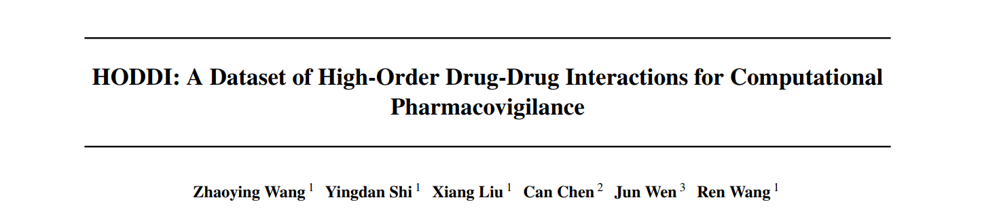

# HODDI: A Dataset of High-Order Drug-Drug Interactions for Computational Pharmacovigilance

[arXiv Paper](https://arxiv.org/abs/2502.06274)

<div align="center">
  
</div>

## Overview

HODDI (Higher-Order Drug-Drug Interaction Dataset) is a comprehensive dataset specifically designed to capture higher-order multi-drug interactions and their collective impact on adverse effects. Constructed from the Food and Drug Administration (FDA) Adverse Event Reporting System (FAERS) spanning 2014Q3-2024Q3, HODDI contains 109,744 records involving 2,506 unique drugs and 4,569 unique side effects. 

Key features of HODDI include:
- Complete coverage of higher-order drug interactions from real-world clinical records
- High-quality side effect standardization using UMLS CUI mappings
- Balanced positive and negative samples for robust model training
- Rich temporal information spanning a decade of records
- Comprehensive drug role categorization (primary suspect, secondary suspect, concomitant)

The dataset addresses critical gaps in existing resources by:
- Capturing complex multi-drug interaction patterns beyond pairwise relationships
- Providing extensive coverage of drug combinations in polypharmacy scenarios
- Maintaining high data quality through rigorous preprocessing and standardization
- Supporting both traditional machine learning and cutting-edge graph-based approaches

## Data Processing Pipeline

### 1. Data Collection and Preprocessing
- Extract quarterly XML files from FAERS (2014Q3-2024Q3)
- Parse and extract key components:
  - Report ID
  - Drug information (standardized names and roles)
  - Side effect descriptions
- Filter records based on drug role conditions:
  - Condition 1: At least two concomitant drugs
  - Condition 2: Primary suspect drug with concomitant drugs
  - Condition 3: All three drug roles present

### 2. Drug Name Standardization
- Normalize drug names:
  - Convert to uppercase
  - Remove salt form suffixes
  - Handle compound names
- Map to DrugBank IDs using DrugBank's comprehensive database

### 3. Side Effect Processing
- Generate embeddings using SapBERT for FAERS side effects and MedDRA terms
- Calculate cosine similarities between embeddings
- Map to recommended MedDRA terms based on similarity
- Query UMLS CUIs from UMLS Metathesaurus
- Stratify by confidence levels using similarity thresholds

### 4. Dataset Construction
- Generate positive samples:
  - Select records with high-confidence side effects
  - Remove duplicates and supersets
- Create negative samples through controlled resampling
- Build evaluation sets using the following criteria:
  - Drug count per record
  - Side effect frequency thresholds
- Build converted evaluation sets using clique expansion method

## Usage

### Environment Setup
```bash
# Set up Python environment
python3.8 -m venv env
source env/bin/activate  # For Unix
.\env\Scripts\activate   # For Windows

# Install dependencies
pip install -r requirements.txt
```

### Dataset Preparation

1. Download FAERS Dataset:
   - Visit [FAERS Website](https://fis.fda.gov/extensions/FPD-QDE-FAERS/FPD-QDE-FAERS.html)
   - Download XML format data for desired quarters
   - Save to `dataset/xml_download/`

2. Download DrugBank Dataset:
   - Obtain DrugBankFullDataBase.xml from [DrugBank Website](https://go.drugbank.com/releases/latest)
   - Save to `dataset/dictionary/`

### Running Data Processing Pipeline

1. Generate HODDI evaluation subsets:
```bash
python ./demo1_dataset_processing_and_statistics/demo1-1_xml2evaluation_subsets.py
```

2. Generate distribution statistics:
```bash
python ./demo1_dataset_processing_and_statistics/demo1-2_evaluation_subsets_statistics.py
```

3. Create evaluation sets:
```bash
python ./demo1_dataset_processing_and_statistics/demo1-3_generate_evaluation_set.py
```

4. Generate converted evaluation sets:
```bash
python ./demo1_dataset_processing_and_statistics/demo1-4_generate_converted_evaluation_set.py
```

### Running Model Benchmarks

1. MLP Model
```bash
# Generate input files
python ./demo2_MLP/demo2-1_generate_MLP_input_files.py

# Train and evaluate MLP
python ./demo2_MLP/demo2-2_MLP.py
```

2. GNN Models
```bash
# Train and evaluate GCN
python ./demo3_GNN/demo3-1_GCN.py

# Train and evaluate GAT
python ./demo3_GNN/demo3-2_GAT.py
```

3. HGNN Models
```bash
# Train and evaluate HyGNN/HGNN-SA
python ./demo4_HGNN/main.py --algorithm smiles2vec --output ./output/ --balanced True --atom_ratio 0.5 --negative_ratio 1 --seed 42
```

To switch between HyGNN and HGNN-SA models, modify the `enable_hygnn` parameter in the model initialization in `main.py`:

```python
model = CLOSEgaps(algorithm=args.algorithm,
                  input_num=node_num,
                  input_feature_num=train_incidence_pos.shape[1],
                  incidence_matrix_pos=incidence_matrix_pos,
                  extra_feature=extra_feature_t,
                  reaction_feature=edges_feature_t,
                  emb_dim=args.emb_dim, conv_dim=args.conv_dim,
                  head=args.head, p=args.p, L=args.L,
                  use_attention=True, enable_hygnn=True).to(device)
```

- Set `enable_hygnn=True` to use the HyGNN model
- Set `enable_hygnn=False` to use the HGNN-SA model

### Visualization
#### Training and Evaluation Metrics
```bash
# Visualize training metrics
python ./demo5_visualization/demo5-1_training_metrics.py

# Compare model performance
python ./demo5_visualization/demo5-2_model_comparison.py
```

#### HODDI Statistic Analysis
```bash
# Drug count per record
python ./demo5_visualization/demo5-3_drug_distribution.py

# Side effect frequency 
python ./demo5_visualization/demo5-4_se_distribution_in_negative_samples.py
python ./demo5_visualization/demo5-5_se_distribution_in_positive_samples.py

# Temporal trends analysis
python ./demo5_visualization/demo5-6_quarterly_trends.py
```

### Citation
```latex
@misc{wang2025hoddidatasethighorderdrugdrug,
      title={HODDI: A Dataset of High-Order Drug-Drug Interactions for Computational Pharmacovigilance}, 
      author={Zhaoying Wang and Yingdan Shi and Xiang Liu and Can Chen and Jun Wen and Ren Wang},
      year={2025},
      eprint={2502.06274},
      archivePrefix={arXiv},
      primaryClass={cs.LG},
      url={https://arxiv.org/abs/2502.06274}, 
}
```